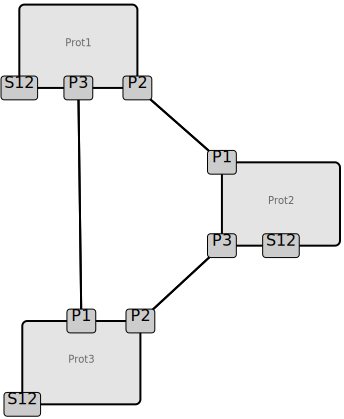
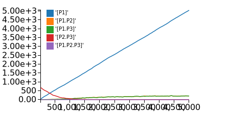

################################
The Kappa Tutorial, v\ |version|
################################
Kappa is a language to write computational models; it is intended for
biochemical signaling cascades, but not constrained to that
use-case. Currently, there are two main platforms to develop and run
Kappa-based models:

* Command-line binaries & script files
* Browser-based proto-IDE_

Power users will probably want to compile from source code. The procedure to achieve
that will be detailled in a second part elsewhere.

As this is a tutorial, we'll write a simple Kappa model and do some basic analysis of it.
The proto-IDE_ will suffice for these purposes, so go ahead an open it in your browser of choice.

****************
The Kappa Script
****************
Kappa script files customarily have the ``.ka`` file extension, e.g.:
``foo.ka``. Each line of code is treated independently, so the order of
instructions doesn't matter (except for variables, who must be
declared prior to being used). While KaSim will not complain about
the structure of the code, your advisor might: understandable scripts
do have a structure. Moreover, they have comments and explanations. In
Kappa, there are 2 kinds of comments:

:line comments: start with the pound symbol ``#`` and end with the end
  of the line
:block comments: start by ``/*`` and end by ``*/``, and can span multiple lines

You can split your model into different files, and tell the simulator
to read them in order. You can also put everything on the same
file. This last usage is the one will be following here.

Roughly speaking, a Kappa script has the following sections:

:Agent Signatures: These define the agents and tokens in our
                   model. An agent (e.g. a protein) has sites it uses
                   to bind and/or to signal it's state (e.g. site ``Y3``
                   in state ``phosphorylated``).
:Variables: These are symbols that represent a value used during the
            simulation, e.g. the binding rates, the volume, some
            complicated algebraic expression.
:Rules: These are the interactions between agents. Due to the nature of the rules, there are effectively 4
        operations in Kappa: change site's bond state (i.e. bind or
        unbind), change site's state (e.g. phosphorylate it, methylate
        it, ubiquitinate it), degrade an agent or set of agents, and
        create an agent or set of agents. These operations can be
        combined into a single rule, or split into multiple rules, depending
        on the behavior we want to simulate.
:Observables: These define the entities for which the simulator will
              output time-course abundances. If we define no
              observables, the simulator will not ouput any abundance.
:Perturbations: These modify the simulation, e.g. we add X amount of
                an agent, alter the rate of a rule, change the state
                of all ``Y17`` sites of agent ``Smith()`` to some state ``gone``.

Agent signature
===============
Files customarily begin with the agent signatures, i.e. how we define our agents and their sites of interaction.
To define an agent, we use the ``%agent:`` keyword, followed by the agent's name, and the agent's sites (between parenthesis).
The syntax is::

%agent: [agent name]([agent's sites])

For example, let's define an agent named ``Protein1`` that has two
sites called ``bindingSiteForProtein2`` and ``bindingSiteForProtein3``,
and a site called ``Serine12``, which can be in state ``Unmodified``,
``Phosphorylated``, or ``Mutated``, with ``Unmodified`` being the default
state. The agent would be defined as::

%agent: Protein1(bindingSiteForProtein2,bindingSiteForProtein3, Serine12~Unmodified~Phosphorylated~Mutated)

Or more succinctly as::

%agent: P1(P2, P3, S12~u~p~m)

.. note::

  Do note however that single letter codes quickly become opaque: if
  ``U`` is for unmodified, what's for ubiquitinated? If ``P`` is for
  phosphorylated, what's for palmitoylated? If ``M`` is for mutated,
  what's for methylated, di-methylated, or tri-methylated? Moreover, the
  English alphabet contains 26 letters, but biochemistry knows of at
  least 27 post-translational modifications. I therefore recommend using
  at least two letters for state (e.g. ``ub``, ``ph``, ``py``, ``1m``,
  ``2m``, ``3m``, ``xx``).

Let's stick with::

%agent: Prot1(P2, P3,S12~un~ph~xx)

In fact, let's define two more agents similar to
``Prot1``, which we'll call ``Prot2`` and ``Prot3``. The sites of ``Prot2`` will be called ``P1`` and ``P3``, while
``Prot3``'s are ``P1`` and ``P2``. And while we're at it, let's add a text
pod in our script to mark where we're at. So far in our script, we
should have::

  ############################################################
  # Here are my agent signatures
  ############################################################
  %agent: Prot1(P2, P3, S12~un~ph~xx)
  %agent: Prot2(P1, P3, S12~un~ph~xx)
  %agent: Prot3(P1, P2, S12~un~ph~xx)

Now, it's time to write how these guys play together.

Rules
=====
Here we will write the rules that dictate how can our agents interact.
A reversible rule's syntax is::

'[rule name]' [left-hand side] <-> [right-hand side] @ [forward rates], [reverse rates]

An irreversible rule's syntax is quite similar::

'[rule name]' [left-hand side] -> [right-hand side] @ [forward rates]

Tthe left-hand side (LHS) is the pattern of reactants, the
right-hand side (RHS) is the pattern of products, and the arrow marks
if it is a reversible (i.e. ``<->``) or irreversible (``->``)
reaction.

In terms of the guts of the simulator, what is doing is
matching the LHS to whatever is in the reaction mixture, and replacing
that with what we wrote in the RHS. In a more formal speech, left go
the sufficient conditions to trigger a rule, and right goes the
pattern injected by said rule's application. The pace at which a rule
is triggered, what would be the rule's activity, is governed by
mass action dynamics. In other words, the probability of rule :math:`i` being
triggered is given by

.. math:: P_i = \frac{A_i}{\sum_{j} A_j }

Where :math:`A_i` is the LHS of rule :math:`i` multiplied by the
respective forward rate of rule :math:`i` (for reverse reactions, it
would be the RHS times the corresponding reverse rate).

Rule Rates
----------
A rule can technically have up to 4 rates::

'[name]' [LHS] <-> [RHS] @ [bimolecular forward rate](unimolecular forward rare), [bimolecular reverse rate] (unimolecular reverse rate)

In practice 3 is the most seen for reversible binding rules, 2 for irreversible binding
rules, 1 for irreversible unbinding rules. The rates are used when:

:bimolecular forward rate: if the LHS has ambiguous molecularity, this
                           is the rate for bimolecular cases. Think of
                           it as the diffusion of two independent
                           entities.
:unimolecular forward rate: if the LHS has ambiguous molecularity,
                            this is the rate for unimolecular
                            cases. Think of it as the interaction of
                            agents already bound, possibly through a
                            third party.
:bimolecular reverse rate: if the RHS has ambiguous molecularity, the
                           rule is reversible, this is the rate for
                           bimolecular cases.
:unimolecular reverse rate: if the RHS has ambiguous molecularity, the
                            rule is reversible, this is the rate for
                            unimolecular cases.

What do we mean by ambiguous molecularity? It means we specify two
agents which may be already connected through a path not described in
a rule. Let's take a look at an example of this.

Ambiguous Molecularity
----------------------

We want to express the reversible binding relation between ``Prot1``
and ``Prot2``, who bind through their respective ``P2`` and ``P1``
sites. For the rates, a determinstic binding rate is on the order of
:math:`10^8`, an unbinding rate around :math:`10^2` (this would mean a
disassociation constant :math:`K_D` of :math:`10^{-10}` molar, or 100
picomolar). When accounting for volume, let's use a mammalian volume
of :math:`10^{-12}` liters, the binding rate becomes :math:`10^{-4}`; the
unbinding rate shouldn't care about volume dependency, so the
deterministic rate is the same as the stochastic one. Thus we arrive
at our stochastic rates, a forward (i.e. bind) rate of :math:`10^{-4}`
and a reverse (i.e. unbind) rate of :math:`10^{-2}`. Let's call such
a rule ``'P1.P2'``, it would be written as::

'P1.P2' Prot1(P2), Prot2(P1) <-> Prot1(P2!1), Prot2(P1!1) @ 1.0e-4,1.0e-2

The usage of ``!n``, where ``n`` is an integer, identifies the binding
endpoints; we could have just as validly used ``!99`` or ``!0``. Let's keep
going and add the other two binding rules, one for ``Prot1`` binding
``Prot3``, and one for ``Prot2`` binding ``Prot3``::

'P1.P3' Prot1(P3), Prot3(P1) <-> Prot1(P3!1), Prot3(P1!1) @ 1.0e-4, 1.0e-2
'P2.P3' Prot2(P3), Prot3(P2) <-> Prot2(P3!1), Prot3(P2!1) @ 1.0e-4, 1.0e-2

.. note::

  It is worth noting that the agents must be in the same order on both
  sides of the arrow signs. If not, they can be taken as spontaneous
  degradation and production of those agents.

Having these three rules, we can render the contact map, which would
look something like this:

Notice there are no unimolecular rates in the above writing of the
rules. This means that the simulator will always use the bimolecular
rate to bind those agents. Consider however what would happen if we
apply a binding rule to agents already bound through a third party!

For example, if we have ``Prot1`` bound to ``Prot2`` itself bound to a
``Prot3``, and we apply the binding rule of that ``Prot1`` to that
``Prot3``, the simulator would use the only rate we gave it, even
though diffusion would play no role in things already bound together. This
would invalidate our physical interpretation of the model. Thus we
should refine the rules by adding a unimolecular forward (i.e. binding)
rate that's much higher than the bimolecular one::

'P1.P2' Prot1(P2), Prot2(P1) <-> Prot1(P2!1), Prot2(P1!1) @ 1.0e-4 (1.0), 1.0e-2
'P1.P3' Prot1(P3), Prot3(P1) <-> Prot1(P3!1), Prot3(P1!1) @ 1.0e-4 (1.0), 1.0e-2
'P2.P3' Prot2(P3), Prot3(P2) <-> Prot2(P3!1), Prot3(P2!1) @ 1.0e-4 (1.0), 1.0e-2

.. note::

  You can consider the unimolecular rate as being similar in spirit to
  the bimolecular rate, but representing diffusion in a much smaller
  volume.

Notice that the RHS of our rules have to be unimolecular: we have the
``!1`` bond right there. The simulator is smart enough to recognize
this and will use ``1.0e-2`` as the sole unbinding rate; there is no
point in giving a bimolecular reverse rate as the RHS can not be
bimolecular. For this reason, it is rare binding rules to have more than
3 rates: a bimolecular binding, a unimolecular binding, and the
unbinding rate.

Let's add another rule. Now we want to add the production of ``Prot1``.
Since for this model we don't care about gene regulation,
transcription, mRNA regulation, translation, protein folding, maturation, or
transport, but just want to have a steady production of the protein,
we can write a simple zeroth-order rule. In this case, said rule could
be written as::

'creation of Prot1' -> Prot1() @ 1.0

Or more succinctly::

'P1/' -> Prot1() @ 1.0

This rule would add one copy of ``Prot1()``, fully unbound, and with sites
in their default state, at around 1 per simulated second. At time 10,
we would have around 10 more copies of ``Prot1``, at time 100, we would have around 100
more copies. So far, our script should look something like this::

  ############################################################
  # Here are my agent signatures
  ############################################################
  %agent: Prot1(P2, P3, S12~un~ph~xx)
  %agent: Prot2(P1, P3, S12~un~ph~xx)
  %agent: Prot3(P1, P2, S12~un~ph~xx)

  ############################################################
  # Here are my rules
  ############################################################
  'P1.P2' Prot1(P2), Prot2(P1) <-> Prot1(P2!1), Prot2(P1!1) @ 1.0e-4 (1.0), 1.0e-2
  'P1.P3' Prot1(P3), Prot3(P1) <-> Prot1(P3!1), Prot3(P1!1) @ 1.0e-4 (1.0), 1.0e-2
  'P2.P3' Prot2(P3), Prot3(P2) <-> Prot2(P3!1), Prot3(P2!1) @ 1.0e-4 (1.0), 1.0e-2
  'P1/' -> Prot1() @ 1.0

Now that we have defined our agents and how the interact, we must define
initial conditions.

Initial Conditions
------------------
The syntax for initial conditions is quite simple::

%init [number or variable] [kappa expression]

Let's say we want to start the simulation with five hundred
copies of ``Prot2`` and ``Prot3``. We could write this as::

 %init: 500 Prot2(), Prot3()

This would start the simulation with the above amounts of each agent,
with all sites unbound, and sites in their default state. If we
wanted to initialize with complexes, we could just as fairly write::

%init: 500 Prot2(P3!1), Prot3(P2!1)

This would add 500 dimers to the simulation. Let's keep these two
declarations of initial conditions. Adding the text pod declaring
the initial condition stage, our script so far would look like this::

  ############################################################
  # Here are my agent signatures
  ############################################################
  %agent: Prot1(P2, P3, S12~un~ph~xx)
  %agent: Prot2(P1, P3, S12~un~ph~xx)
  %agent: Prot3(P1, P2, S12~un~ph~xx)

  ############################################################
  # Here are my rules
  ############################################################
  'P1.P2' Prot1(P2), Prot2(P1) <-> Prot1(P2!1), Prot2(P1!1) @ 1.0e-4 (1.0), 1.0e-2
  'P1.P3' Prot1(P3), Prot3(P1) <-> Prot1(P3!1), Prot3(P1!1) @ 1.0e-4 (1.0), 1.0e-2
  'P2.P3' Prot2(P3), Prot3(P2) <-> Prot2(P3!1), Prot3(P2!1) @ 1.0e-4 (1.0), 1.0e-2
  'P1/' -> Prot1() @ 1.0

  ############################################################
  # Here are my initial conditions
  ############################################################
  %init: 500 Prot2(), Prot3()
  %init: 500 Prot2(P3!1), Prot3(P2!1)

It's now time to declare the observables.

Observables
-----------
This is one of the most important parts of the script as this dictate
the program's plotting output. If we specify the rules and initial
mixture perfectly, but forget to observe for something, then we will
see nothing.

The syntax is quite simple, we begin with ``%obs:``, then
assign a name to that tracking event with ``'name'``, and finally the code
of what exactly is the program tracking flanked by pipe symbols ``|``. For example::

%obs: 'Amount of Protein 1' |Prot1()|

Or more succinctly::

%obs: '[P1]' |Prot1()|

This would report the total amount of agent ``Prot1`` under label ``'[P1]'``,
in whatever state it is, bound, unbound, modified, etc.

This means that on the output file, one of the column headers will be
``'[P1]'``, and for that column, each row will be the time-point indexed
abundance of the label's definition; i.e. how much ``Prot1()`` was there
at those times. Let's define three more observables, in this case the
dimers of the system.

::

%obs: '[P1.P2]' |Prot1(P2!1,P3), Prot2(P1!1,P3)|
%obs: '[P1.P3]' |Prot1(P2,P3!1), Prot3(P1!1,P2)|
%obs: '[P2.P3]' |Prot2(P1,P3!1), Prot3(P1,P2!1)|

From the contact map, we see this the system has the capacity to
generate a cycle. Let's add another observable to check how many of
these trimer cycles there are. We would be observing for a ``Prot1``
bound to a ``Prot2`` that's bound to ``Prot3`` itself bound to the
initial ``Prot1``.

::

%obs: '[P1.P2.P3]' Prot1(P2!1,P3!3), Prot2(P1!1,P3!2), Prot3(P1!3,P2!2)

So far, our script should look something like this::

  ############################################################
  # Here are my agent signatures
  ############################################################
  %agent: Prot1(P2, P3, S12~un~ph~xx)
  %agent: Prot2(P1, P3, S12~un~ph~xx)
  %agent: Prot3(P1, P2, S12~un~ph~xx)

  ############################################################
  # Here are my rules
  ############################################################
  'P1.P2' Prot1(P2), Prot2(P1) <-> Prot1(P2!1), Prot2(P1!1) @ 1.0e-4 (1.0), 1.0e-2
  'P1.P3' Prot1(P3), Prot3(P1) <-> Prot1(P3!1), Prot3(P1!1) @ 1.0e-4 (1.0), 1.0e-2
  'P2.P3' Prot2(P3), Prot3(P2) <-> Prot2(P3!1), Prot3(P2!1) @ 1.0e-4 (1.0), 1.0e-2
  'P1/' -> Prot1() @ 1.0

  ############################################################
  # Here are my initial conditions
  ############################################################
  %init: 500 Prot2(), Prot3()
  %init: 500 Prot2(P3!1), Prot3(P2!1)

  ############################################################
  # Here are my observables
  ############################################################
  %obs: '[P1]' |Prot1()|
  %obs: '[P1.P2]' |Prot1(P2!1,P3), Prot2(P1!1,P3)|
  %obs: '[P1.P3]' |Prot1(P2,P3!1), Prot3(P1!1,P2)|
  %obs: '[P2.P3]' |Prot2(P1,P3!1), Prot3(P1,P2!1)|
  %obs: '[P1.P2.P3]' |Prot1(P2!1,P3!3), Prot2(P1!1,P3!2), Prot3(P1!3,P2!2)|

Execution
---------
Now `let's execute the simulation!`_ If you're using the proto-IDE_ specify
a simulated time of 5000 seconds and 150 points to plot. If you're running the
command-line executable, save your file (e.g. "MyFile.ka") and invoke
KaSim with input-file "MyFile.ka", to simulate 5000 seconds, and
output 150 plot points to a file called "MyOutput.out", i.e.::

$KaSim -i MyFile.ka -t 5000 -p 150 -o MyOutput.svg

This should generate a plot like this:

.. image:: img/Trajectories_all.svg

Notice that, as expected, the amount of P1 steadily increases. Notice
also that the amount of trimer increases up to a point, and then
decreases. In other words, in early times, the amount of ``Prot1`` was
limiting the assembly of the trimer: there was not enough to go
around. However, at late times, there was too much. Notice the amount
of the dimers that contain ``Prot1``, i.e. ``P1.P2`` and ``P1.P3``, steadily
increase. Thus, although ``Prot2`` and ``Prot3`` are still binding
independently ``Prot1``, the likelihood that they bind the same ``Prot1``
decreases as ``Prot1`` accumulates. This inhibitory phenomenon is called a
prozone, and is very well known in immunology as the Hook effect. It
is a product of the concurrency between the binding for ``Prot1`` of ``Prot2`` vs.
``Prot3`` .

`Let's keep playing!`_ Now let's think of what would happen if we set the
unimolecular binding rates to zero. That is, we disallow entities that
are already bound, from further binding. If we set the rates to zero,
and hit run with the same plotting parameters, we would get something
like this:

The amount of trimer cycle is now zero, as we expected. Things that are bound, can not bind further.
However, the
system is not dominated by the dimers we defined. There are a thousand
copies of Prot2 and Prot3, but the amount of dimers does not add up to
this. What is happening? We can take a look at the reaction mixture by
using perturbations.

Perturbations and Modifications
-------------------------------

Let's start by checking the state of the reaction mixture, in what is
called a ``snapshot``. We can tell KaSim to produce a snapshot at any
given time with::

%mod: [T]>4500 do $SNAPSHOT

This will ouput a snapshot when the simulation advances past
timepoint 4500. In the IDE, such a snapshot would look like this:

TODO .. image:: img/Snapshot.svg

As we can see, the system has produced polymers! Instead of having
dimers, we have much bigger oligomers. How did this happen? Well, when
we made the rules, we only mentioned some sites. For example, the
binding of ``Prot1`` and ``Prot2`` only mentions their ``P2`` and ``P1`` sites; it says nothing about their respective ``P3`` sites. Thus, this event is independent of whatever is the state of those ``P3`` sites. If there are two dimers, say ``P1.P3`` and ``P2.P3``, those ``P1`` and ``P2`` can bind to generate the ``P3.P1.P2.P3`` tetramer, and so on.

In Kappa, we only write the sites that we care about,
and by omitting everything we don't care about, claim independence of
it. Our three dimerization events are therefore all independent, so
there are no geometric constraints.

This illustrates a consequence of Kappa's don't care,
don't write philosophy. If the mechanism we are trying to express 
states only that those bonds depend on those sites, the system does
indeed have the capacity to oligomerize, even if the modeler did
not write that in.

If we wanted a system with geometric constrains, that means the sites
would be constrained to each other's bond-state. To make a 3 agent system where the biggest
entity is the trimer, one would have to write the 3 possible collision events of
the respective obligate monomers, in addition to the 3 collision events
of the monomers with the compatible dimers. In effect, one ends up writting molecular
species (i.e. where every site is declared) instead of patterns
(i.e. where some things are omitted for independence), to include the
geometric constrains.

Causal analysis
===============
ToDo

******************
Local installation
******************
ToDo

*******************
Glossary of Symbols
*******************
:#: start comment
:%agent\:: command to define an agent
:%obs\:: command to define an observable
:%var\:: command to define a variable
:%mod\:: command to define a modification or perturbation
:%def\:: command to define something, like a file name or the
       graphical format of a snapshot
:'': internal naming quotations, for rule names (' vs. ")
:"": external naming quotations, for file names (' vs. ")
:@: specify the reaction's rate
:@ X,Y: forward, reverse rate for the reversible reaction
:@ X(Y): bi(uni) -molecular rate for the rule with a molecularly
         ambiguous LHS
:Smith(foo): Specifies a site foo on agent Smith
:Y!x: Where x is a number, it indicates the bond's identity ending on
      site Y
:Y!_: Indicates site Y in any bond status (useful in observables)
:Y?: Indicates it doesn't matter if site Y is bound, to what, or not
     (notice the absence of !)
:Y~foo: Specifies site Y 's state as foo

.. _proto-IDE : https://dev/executableknowledge.org/try/
.. _let's execute the simulation! : http://dev.executableknowledge.org/try/?time_limit=5000&nb_plot=150&model_text=%23%23%23%23%23%23%23%23%23%23%23%23%23%23%23%23%23%23%23%23%23%23%23%23%23%23%23%23%23%23%23%23%23%23%23%23%23%23%23%23%23%23%23%23%23%23%23%23%23%23%23%23%23%23%23%23%23%23%23%23%0A%23%20Here%20are%20my%20agent%20signatures%0A%23%23%23%23%23%23%23%23%23%23%23%23%23%23%23%23%23%23%23%23%23%23%23%23%23%23%23%23%23%23%23%23%23%23%23%23%23%23%23%23%23%23%23%23%23%23%23%23%23%23%23%23%23%23%23%23%23%23%23%23%0A%25agent%3A%20Prot1%28P2%2C%20P3%2C%20S12%7Eun%7Eph%7Exx%29%0A%25agent%3A%20Prot2%28P1%2C%20P3%2C%20S12%7Eun%7Eph%7Exx%29%0A%25agent%3A%20Prot3%28P1%2C%20P2%2C%20S12%7Eun%7Eph%7Exx%29%0A%0A%23%23%23%23%23%23%23%23%23%23%23%23%23%23%23%23%23%23%23%23%23%23%23%23%23%23%23%23%23%23%23%23%23%23%23%23%23%23%23%23%23%23%23%23%23%23%23%23%23%23%23%23%23%23%23%23%23%23%23%23%0A%23%20Here%20are%20my%20rules%0A%23%23%23%23%23%23%23%23%23%23%23%23%23%23%23%23%23%23%23%23%23%23%23%23%23%23%23%23%23%23%23%23%23%23%23%23%23%23%23%23%23%23%23%23%23%23%23%23%23%23%23%23%23%23%23%23%23%23%23%23%0A%27P1.P2%27%20Prot1%28P2%29%2C%20Prot2%28P1%29%20%3C-%3E%20Prot1%28P2%211%29%2C%20Prot2%28P1%211%29%20@%201.0e-4%20%281.0%29%2C%201.0e-2%0A%27P1.P3%27%20Prot1%28P3%29%2C%20Prot3%28P1%29%20%3C-%3E%20Prot1%28P3%211%29%2C%20Prot3%28P1%211%29%20@%201.0e-4%20%281.0%29%2C%201.0e-2%0A%27P2.P3%27%20Prot2%28P3%29%2C%20Prot3%28P2%29%20%3C-%3E%20Prot2%28P3%211%29%2C%20Prot3%28P2%211%29%20@%201.0e-4%20%281.0%29%2C%201.0e-2%0A%27P1/%27%20-%3E%20Prot1%28%29%20@%201.0%0A%0A%23%23%23%23%23%23%23%23%23%23%23%23%23%23%23%23%23%23%23%23%23%23%23%23%23%23%23%23%23%23%23%23%23%23%23%23%23%23%23%23%23%23%23%23%23%23%23%23%23%23%23%23%23%23%23%23%23%23%23%23%0A%23%20Here%20are%20my%20initial%20conditions%0A%23%23%23%23%23%23%23%23%23%23%23%23%23%23%23%23%23%23%23%23%23%23%23%23%23%23%23%23%23%23%23%23%23%23%23%23%23%23%23%23%23%23%23%23%23%23%23%23%23%23%23%23%23%23%23%23%23%23%23%23%0A%25init%3A%20500%20Prot2%28%29%2C%20Prot3%28%29%0A%25init%3A%20500%20Prot2%28P3%211%29%2C%20Prot3%28P2%211%29%0A%0A%23%23%23%23%23%23%23%23%23%23%23%23%23%23%23%23%23%23%23%23%23%23%23%23%23%23%23%23%23%23%23%23%23%23%23%23%23%23%23%23%23%23%23%23%23%23%23%23%23%23%23%23%23%23%23%23%23%23%23%23%0A%23%20Here%20are%20my%20observables%0A%23%23%23%23%23%23%23%23%23%23%23%23%23%23%23%23%23%23%23%23%23%23%23%23%23%23%23%23%23%23%23%23%23%23%23%23%23%23%23%23%23%23%23%23%23%23%23%23%23%23%23%23%23%23%23%23%23%23%23%23%0A%25obs%3A%20%27%5BP1%5D%27%20Prot1%28%29%0A%25obs%3A%20%27%5BP1.P2%5D%27%20Prot1%28P2%211%2CP3%29%2C%20Prot2%28P1%211%2CP3%29%0A%25obs%3A%20%27%5BP1.P3%5D%27%20Prot1%28P2%2CP3%211%29%2C%20Prot3%28P1%211%2CP2%29%0A%25obs%3A%20%27%5BP2.P3%5D%27%20Prot2%28P1%2CP3%211%29%2C%20Prot3%28P1%2CP2%211%29%0A%25obs%3A%20%27%5BP1.P2.P3%5D%27%20Prot1%28P2%211%2CP3%213%29%2C%20Prot2%28P1%211%2CP3%212%29%2C%20Prot3%28P1%213%2CP2%212%29
.. _let's keep playing! : http://dev.executableknowledge.org/try/?time_limit=5000&nb_plot=150&model_text=%23%23%23%23%23%23%23%23%23%23%23%23%23%23%23%23%23%23%23%23%23%23%23%23%23%23%23%23%23%23%23%23%23%23%23%23%23%23%23%23%23%23%23%23%23%23%23%23%23%23%23%23%23%23%23%23%23%23%23%23%0A%23%20Here%20are%20my%20agent%20signatures%0A%23%23%23%23%23%23%23%23%23%23%23%23%23%23%23%23%23%23%23%23%23%23%23%23%23%23%23%23%23%23%23%23%23%23%23%23%23%23%23%23%23%23%23%23%23%23%23%23%23%23%23%23%23%23%23%23%23%23%23%23%0A%25agent%3A%20Prot1%28P2%2C%20P3%2C%20S12%7Eun%7Eph%7Exx%29%0A%25agent%3A%20Prot2%28P1%2C%20P3%2C%20S12%7Eun%7Eph%7Exx%29%0A%25agent%3A%20Prot3%28P1%2C%20P2%2C%20S12%7Eun%7Eph%7Exx%29%0A%0A%23%23%23%23%23%23%23%23%23%23%23%23%23%23%23%23%23%23%23%23%23%23%23%23%23%23%23%23%23%23%23%23%23%23%23%23%23%23%23%23%23%23%23%23%23%23%23%23%23%23%23%23%23%23%23%23%23%23%23%23%0A%23%20Here%20are%20my%20rules%0A%23%23%23%23%23%23%23%23%23%23%23%23%23%23%23%23%23%23%23%23%23%23%23%23%23%23%23%23%23%23%23%23%23%23%23%23%23%23%23%23%23%23%23%23%23%23%23%23%23%23%23%23%23%23%23%23%23%23%23%23%0A%27P1.P2%27%20Prot1%28P2%29%2C%20Prot2%28P1%29%20%3C-%3E%20Prot1%28P2%211%29%2C%20Prot2%28P1%211%29%20@%201.0e-4%20%280%29%2C%201.0e-2%0A%27P1.P3%27%20Prot1%28P3%29%2C%20Prot3%28P1%29%20%3C-%3E%20Prot1%28P3%211%29%2C%20Prot3%28P1%211%29%20@%201.0e-4%20%280%29%2C%201.0e-2%0A%27P2.P3%27%20Prot2%28P3%29%2C%20Prot3%28P2%29%20%3C-%3E%20Prot2%28P3%211%29%2C%20Prot3%28P2%211%29%20@%201.0e-4%20%280%29%2C%201.0e-2%0A%27P1/%27%20-%3E%20Prot1%28%29%20@%201.0%0A%0A%23%23%23%23%23%23%23%23%23%23%23%23%23%23%23%23%23%23%23%23%23%23%23%23%23%23%23%23%23%23%23%23%23%23%23%23%23%23%23%23%23%23%23%23%23%23%23%23%23%23%23%23%23%23%23%23%23%23%23%23%0A%23%20Here%20are%20my%20initial%20conditions%0A%23%23%23%23%23%23%23%23%23%23%23%23%23%23%23%23%23%23%23%23%23%23%23%23%23%23%23%23%23%23%23%23%23%23%23%23%23%23%23%23%23%23%23%23%23%23%23%23%23%23%23%23%23%23%23%23%23%23%23%23%0A%25init%3A%20500%20Prot2%28%29%2C%20Prot3%28%29%0A%25init%3A%20500%20Prot2%28P3%211%29%2C%20Prot3%28P2%211%29%0A%0A%23%23%23%23%23%23%23%23%23%23%23%23%23%23%23%23%23%23%23%23%23%23%23%23%23%23%23%23%23%23%23%23%23%23%23%23%23%23%23%23%23%23%23%23%23%23%23%23%23%23%23%23%23%23%23%23%23%23%23%23%0A%23%20Here%20are%20my%20observables%0A%23%23%23%23%23%23%23%23%23%23%23%23%23%23%23%23%23%23%23%23%23%23%23%23%23%23%23%23%23%23%23%23%23%23%23%23%23%23%23%23%23%23%23%23%23%23%23%23%23%23%23%23%23%23%23%23%23%23%23%23%0A%25obs%3A%20%27%5BP1%5D%27%20Prot1%28%29%0A%25obs%3A%20%27%5BP1.P2%5D%27%20Prot1%28P2%211%2CP3%29%2C%20Prot2%28P1%211%2CP3%29%0A%25obs%3A%20%27%5BP1.P3%5D%27%20Prot1%28P2%2CP3%211%29%2C%20Prot3%28P1%211%2CP2%29%0A%25obs%3A%20%27%5BP2.P3%5D%27%20Prot2%28P1%2CP3%211%29%2C%20Prot3%28P1%2CP2%211%29%0A%25obs%3A%20%27%5BP1.P2.P3%5D%27%20Prot1%28P2%211%2CP3%213%29%2C%20Prot2%28P1%211%2CP3%212%29%2C%20Prot3%28P1%213%2CP2%212%29
