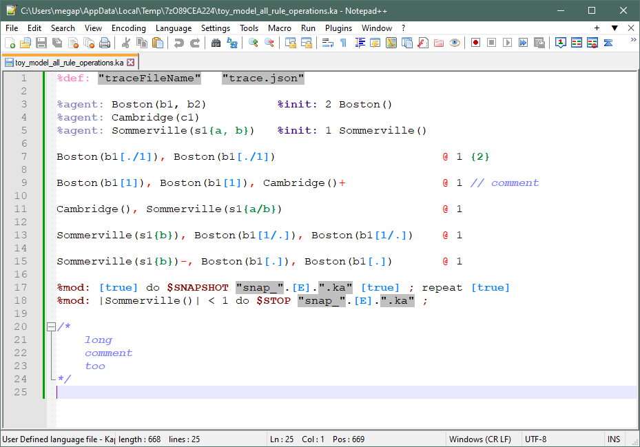

# NotepadPP_Kappa_plugin

A plugin for syntax highlighting of the [Kappa language](https://kappalanguage.org) for [Notepad++](https://notepad-plus-plus.org).

This was designed for highlighting edit-notation operations, introduced in the Kappa Simulator v4, while also supporting legacy chemical-notation operations.

## Installation

To install the Kappa language highlighter in Notepad++, download the [highlighter .xml](./KappaLanguageHighlighter.xml) file, then in Notepad++:

Language Menu -> DefineYourLanguage -> Import

## See also

For rendering Kappa files into HTML, LaTeX, PDF, or other formats, we [provide a plugin](../Pygments_Kappa_plugin-master/) for the [Pygments framework](https://pygments.org).

Project originally hosted at https://github.com/hmedina/NotepadPP_Kappa_plugin