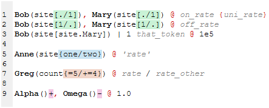
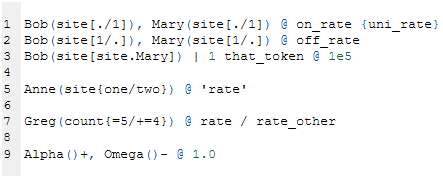
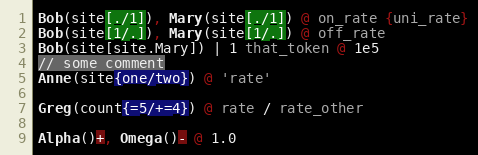
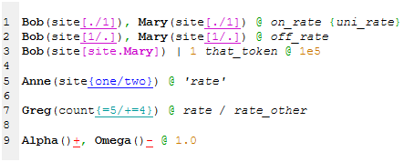

# Pygments Kappa plugin

A plugin for the [Pygments package](https://pygments.org/) adding lexing and styling support for the [Kappa language](https://kappalanguage.org/).



## Installation
This is a python plugin, and uses `setuptools` entry points to extend the lexers and styles known to Pygments. It thus works on a stock Pygments installation.

`pip install . [--user]`


## Uninstallation
If unsure of the package name, use `pip freeze` to display the list of packages pip is aware of. Otherwise:

`pip uninstall Pygments-Kappa-plugin`


## Usage
Once installed, the entire Pygments stack will be aware of the new lexer and styles. This includes the [command-line script](https://pygments.org/docs/cmdline/) `pygmentize`. For example, to highlight a file called `foo.ka` using the style `kappa_style_edit`, formatting into an HTML file that contains the CSS style-sheet (i.e. a "full" file) called `foo.html`: 

``pygmentize -f html -O style=kappa_style_edit,full -o foo.html foo.ka``[^1]

[^1]: As the lexer declares `.ka` as the extension for kappa files, it doesn't have to be specified so long as the input file has that extension.

The Pygments-provided formatters to `LaTeX` and various image formats are supported[^2].

[^2]: The rasterized image formatters (i.e. `png`, `bmp`, `jpg`) have poor support for coloring text background (some work was done in [PR 1374](https://github.com/pygments/pygments/pull/1374)) or underlining, so for advanced styling, the `LaTeX` and `HTML` formatters are recommended.


## Contents
Pygments works by having a lexer issue a token for every component it finds. Those tokens are then styled by a user-given style-sheet. Thus the plugin consists of a module `core` containing three files, `KappaLexer.py`, `KappaStyle.py`, and `KappaToken.py`, each for a class type.

### KappaLexer
`KappaLexer.py` contains the lexer, a multi-state parser based on regular expressions. As of this writing, it lexes the entire KaSim4 test suite successfully (the files that pass the test suite anyhow...).

### KappaToken
Given the hierarchy of Kappa expressions, I designed the token structure to take advantage of inheritance to form a tree. The file `KappaToken.py` declares this tree, and is meant to be modular. For convenience, each tree element has an alias, e.g. `Agent_name` in `Agent_Name = Token.Kappa.Rule.Agent.Name`; the alias is what is referenced in the style sheet.

As an example of the inheritance mechanism, a style that applies to `Token.Kappa.Rule.Agent` will be inherited to all its children, including:
 ```
 Token.Kappa.Rule.Agent.Name
 Token.Kappa.Rule.Agent.Signature.Site
 Token.Kappa.Rule.Agent.Signature.Site.Internal.State
 ```
By the same logic, a style that applies to `Token.Kappa.Rule.Agent.Name` will not apply to `Token.Kappa.Rule.Agent.Signature`. This means one can highlight agent names without highlighting the agent signature, or the parenthesis around it, or italicize the agent signature components without italicizing the surrounding parenthesis or in-woven commas.

This inheritance mechanism coupled with the multi-state lexer allows the distinction of identical local syntax in different uses, for example a counter edit operation vs. a counter's range in the agent's declaration; the former lives under `Token.Kappa.Rule` while the latter under `Token.Kappa.Declaration`, even though their syntax is identical. 

### KappaStyle
The token inheritance behavior allows one to define a style for the various components of a kappa file. These are defined in the `KappaStyle` file. These are provided:


#### `kappa_style_browser`
Mimics the style used in the "KaSim-in-browser" [GUI](https://tools.kappalanguage.org/try/?model=https%3A//raw.githubusercontent.com/Kappa-Dev/KaSim/master/models/abc-pert.ka), the only addition is the proper handling of counter syntax in agent declarations.



#### `kappa_style_edit`
Agent names in rules will be bolded, edit operations will have a colored background according to their type: bond changes in green, state changes in blue, counter changes in orange, agent abundance changes in red. This style was developped to present the code in my PhD thesis, being designed to ease identification of edit operations in rules that have a lot of material in their contexts (i.e. long rules).


#### `kappa_style_edit_dark`
Dark twin of the above. Agent names in rules will be bolded, edit operations will have a colored background according to their type: bond changes in green, state changes in blue, counter changes in orange, agent abundance changes in red.



#### `kappa_style_demo`
Showcases some nuances the lexer is capable of, like bolding the agent name that types a bond, or only underlining edit operations ignoring bond typing constraints.




## Creating custom styles
Style rules are partially documented by Pygments in the [package documentation](https://pygments.org/docs/styles/#style-rules). To create a custom style (for examples, see `core/KappaStyle.py`):
1) Create a subclass that inherits from `pygments.style:Style`, e.g. `MathyStyle(Style)`
1) Add the `default_style` (everything not specified later will default to this style)
1) Add the `styles` dictionary, where keys are token aliases (see `core/KappaToken.py`) and values a string with the desired appearance.
1) Save somewhere (e.g. under `core/MyStyles.py`) and declare it in the `setup.py` file's entrypoints (e.g. add `my_super_kappa_style = core.MyStyles:MathyStyle` in the `[pygments.styles]` section).
1) Refresh/reinstall the plugin so the entry point database gets updated.
1) Pygments should now be aware of the new style; try `$ pygmentize -S` to display the entire list of lexers, formatters, and styles. `my_super_kappa_style` should be in the list.


## See also

We also provide a [syntax-highlighting plugin](../NotepadPP_Kappa_plugin/) for [Notepad++](https://notepad-plus-plus.org/)

Originally hosted at https://github.com/hmedina/Pygments_Kappa_plugin